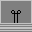

# Machinic
Machinic is a game where you can create machines (in this game called as "projects").

This repo is partially built with the `git` CLI tool. First time using that!
## The Machinic Dictionary
|Word|Meaning|
|:-:|:-:|
|Project|A new creation|
|Block|The item you use to make expressions|
|Expression|An expression is like a hidden ability that enables blocks to work as they are supposed to|
## A list of the blocks in Machinic
|Image|Name|Description|
|:-:|:-:|:-:|
||Flipper|Can toggle the ability to function for next blocks|
||Lighter|"Lights up" when **ON**|
||Shy-Block|"Hides" next blocks and itself|
